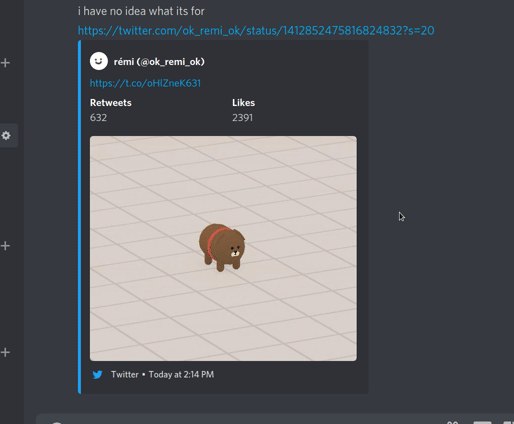

# TwitFix

Basic flask server that serves fixed twitter video embeds to desktop discord by using either the Twitter API or Youtube-DL to grab tweet video information. This also automatically embeds the first link in the text of non video tweets (API Only)

## How to use (discord side)

just put the url to the server, and directly after, the full URL to the tweet you want to embed

**I now have a copy of this running on a Linode server, you can use it via the following url**

```
https://fxtwitter.com/[twitter video url] or [last half of twitter url] (everything past twitter.com/)
```

You can also simply type out 'fx' directly before 'twitter.com' in any valid twitter video url, and that will convert it into a working TwitFix url, for example:



**Note**: If you enjoy this service, please considering donating via [Ko-Fi](https://ko-fi.com/robin_universe) to help cover server costs

## Child Projects:

[TwitFix-Bot](https://github.com/robinuniverse/TwitFix-Bot) - A discord bot for automatically converting normal twitter links posted by users into twitfix links

[TwitFix-Extension](https://github.com/robinuniverse/TwitFix-Extension) - A browser extention that lets you right click twitter videos to copy a twitfix link to your clipboard

# Monthly Contributors

TwitFix is run for free, period, I have no plans to monetize it directly in any way ( no ads, no premium accounts with more features ) so I rely on donations to keep TwitFix running, and I have created the option to [donate on a monthly basis using my KoFi](https://ko-fi.com/robin_universe#tier16328580186740)


Here's a a list of the people who help to keep this project alive! ( current total monthly - $49!!! )

1. [$3] First Contributor and Twitter Funnyman **Chris Burwell** ( [@countchrisdo](https://twitter.com/countchrisdo) on Twitter )

2. [$9] Previously highest Contributor, Suspciously wealthy furry, and a very loving friend **Vectrobe** ( [@Vectrobe](https://twitter.com/Vectrobe) on Twitter )

3. [$10] New highest monthly contributor, helloitscrash!

4. [$6] A Mysterious and Anonymous contributor...

5. [$10] One of the highest contributors, Ryan Vilbrandt!

6. [$3] Starcat13, the one with the coolest sounding name

7. [$5] THE LIGHT THROUGH WHICH GOD SPEAKS TO THIS EARTH: Statek

8. [$3] Impulse, probably the source cheat

9. [$3] a STRONG contendor for coolest name, "Lost in Art & Magic"       

## How to run (server side)

this script uses the youtube-dl python module, along with flask, twitter and pymongo, so install those with pip (you can use `pip install -r requirements.txt`) and start the server with `python twitfix.py`

I have included some files to give you a head start on setting this server up with uWSGI, though if you decide to use uWSGI I suggest you set up mongoDB link caching 

### Config

TwitFix generates a config.json in its root directory the first time you run it, the options are:

**API** - This will be where you put the credentials for your twitter API if you use this method

**database** - This is where you put the URL to your mongoDB database if you are using one

**link_cache** - (Options: **db**, **json**)

- **db**: Caches all links to a mongoDB database. This should be used it you are using uWSGI and are not just running the script on its own as one worker
- **json**: This saves cached links to a local **links.json** file

**method** - ( Options: **youtube-dl**, **api**, **hybrid** ) 

- **youtube-dl**: the original method for grabbing twitter video links, this uses a guest token provided via youtube-dl and should work well for individual instances, but may not scale up to a very large amount of usage

- **api**: this directly uses the twitter API to grab tweet info, limited to 900 calls per 15m
- **hybrid**: This will start off by using the twitter API to grab tweet info, but if the rate limit is reached or the api fails for any other reason it will switch over to youtube-dl to avoid downtime

**color** - Accepts a hex formatted color code, can change the embed color

**appname** - Can change the app name easily wherever it's shown

**repo** - used to change the repo url that some links redirect to

**url** - used to tell the user where to look for the oembed endpoint, make sure to set this to your public facing url

This project is licensed under the **Do What The Fuck You Want Public License**


## Other stuff

Going to `https://fxtwitter.com/latest/` will present a page that shows the all the latest tweets that were added to the database, use with caution as results may be nsfw! Current page created by @DorukSaga

Using the `/dir/<video-url>` endpoint will return a redirect to the direct MP4 link, this can be useful for downloading a video

Using the `/dl/<video-url>` or appending a `.mp4` will make the server download the video and return a static, locally hosted copy

Using the subdomain `d.fxtwitter.com/<video-url>` will redirect to a direct MP4 url hosted on Twitter

Using the `/info/<video-url>` endpoint will return a json that contains all video info that youtube-dl can grab about any given video

Using `/other/<video-url>` will attempt to run the twitter embed stuff on other websites videos - This is mostly experimental and doesn't really work for now 

Using `/api/latest/` will return a json with the latest tweet added to the database. Takes params `?tweets=INT&=pageINT` to return multiple

Using `/api/top/` will return a json with the most hit tweet in the database. Takes params `?tweets=INT&=pageINT` to return multiple

Using `/api/stats/` will return a json with some stats about TwitFix's activity (embeds, new cached links, API hits, downloads). Takes param `?=date"YYYY-MM-DD"` to return a specific day, otherwise will return today's stats to far

Advanced embeds are provided via a `/oembed.json?` endpoint - This is manually pointing at my server in `/templates/index.html` and should be changed from `https://fxtwitter.com/` to whatever your domain is

We check for t.co links in non video tweets, and if one is found, we direct the discord useragent to embed that link directly, this means that twitter links containing youtube / vimeo links will automatically embed those as if you had just directly linked to that content
